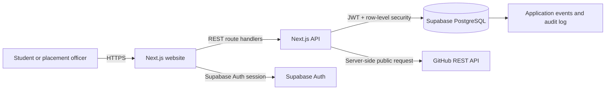
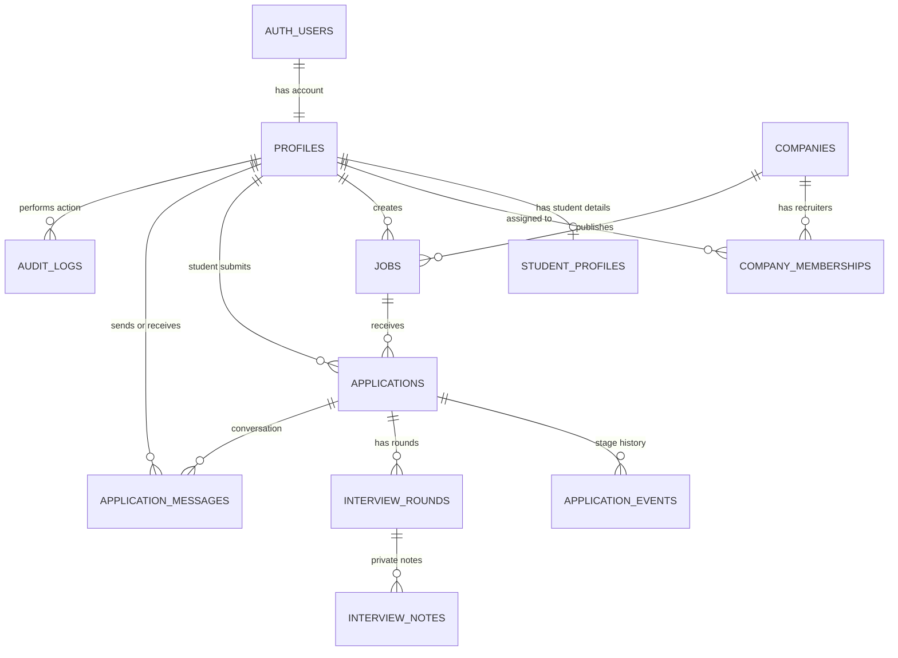

# HireTrack

HireTrack is a campus placement and candidate progress platform. The app uses Next.js for the website and REST API, Supabase Auth for sign-in, and Supabase PostgreSQL for persisted placement records. GitHub profile enrichment is fetched through a server route so the browser never calls GitHub directly.

## Get started locally

1. Install Node.js 20.9 or newer and pnpm.
2. Install dependencies with `pnpm install`.
3. Copy `.env.example` to `.env.local` and fill in the Supabase project URL and publishable/anon key.
4. In Supabase SQL Editor, run `supabase/migrations/0001_initial_schema.sql` in a new project.
5. Run `supabase/migrations/0002_recruiter_workflows.sql` after the initial schema.
6. Run `supabase/migrations/0003_audit_and_job_search.sql` to record sign-ins, job changes, interview updates, and sent messages.
7. Start the app with `pnpm dev` and open `http://localhost:3000`.
8. Register a student account at `/login`. Supabase creates the profile and student profile automatically.
9. To create the placement officer, register a second account, then promote it in Supabase SQL Editor:

   ```sql
   update public.profiles
   set role = 'officer'
   where email = 'officer@example.edu';
   ```

10. Sign in as the officer, post opportunities, and use `/team` to assign company recruiters. Recruiters register first, and the placement officer assigns their account using its email address.
11. Run `supabase/seed.sql` if you want sample opportunities.

Without Supabase environment variables, the application asks you to connect Supabase; it does not display invented candidate or company activity. Configure Supabase before using the platform.

## Environment variables

| Variable | Where it is used | Value |
| --- | --- | --- |
| `NEXT_PUBLIC_SUPABASE_URL` | Browser and server | Supabase project URL |
| `NEXT_PUBLIC_SUPABASE_ANON_KEY` | Browser and server | Supabase publishable/anon key; RLS protects data access |

Never put a Supabase service-role key in a `NEXT_PUBLIC_` variable or commit real credentials. The schema enables row-level security and relies on Supabase Auth JWTs.

## API routes

All routes return JSON. Authenticated requests send `Authorization: Bearer <Supabase access token>`.

| Method | Route | Access | Purpose |
| --- | --- | --- | --- |
| `GET` | `/api/jobs?search=&status=` | Public for published jobs; staff can see all | List and filter opportunities |
| `GET` | `/api/jobs?jobId=<uuid>` | Public for published jobs; staff can see all | Read one opportunity for `/jobs/<uuid>` |
| `POST` | `/api/jobs` | Officer or recruiter | Create and publish a job; validates title and company |
| `GET` | `/api/applications?stage=&jobId=` | Signed-in user, scoped by RLS | List the student’s applications or staff pipeline |
| `POST` | `/api/applications` | Student | Apply to a published job; unique constraint prevents duplicates |
| `PATCH` | `/api/applications` | Officer or recruiter | Move an application to a new stage; database trigger records history |
| `GET`, `POST`, `PATCH` | `/api/interviews` | Officer or assigned recruiter | Schedule interviews and save private notes separately from candidate-visible feedback |
| `GET`, `POST`, `PATCH` | `/api/messages` | Application participants | Send, read, and mark messages read in an application conversation |
| `GET`, `POST`, `DELETE` | `/api/team` | Placement officer | Assign or remove company-scoped recruiter access |
| `GET` | `/api/activity` | Placement officer or recruiter | View application timeline events |
| `GET` | `/api/audit` | Placement officer | View sign-ins and durable job, application, interview, and message events |
| `GET` | `/api/github/[username]` | Public | Fetch and normalize a public GitHub profile and top repositories |

The application stage values are `applied`, `screening`, `interview`, `offer`, `rejected`, and `withdrawn`. Invalid input returns a useful JSON error with a 4xx status. The database records stage changes in `application_events` and `audit_logs`.

## Database and demo data

Run migrations `0001`, `0002`, then `0003` in order before creating users. They create `profiles`, `student_profiles`, `companies`, `jobs`, `applications`, `interview_rounds`, `application_events`, `audit_logs`, company memberships, messages, and private interview notes. They provide role-based row-level security, company-scoped recruiter access, automatic student profile creation, application history, and database audit events. If `0001` and `0002` were already run, do not run them again; apply only `0003`.

`supabase/seed.sql` creates a sample company and two published jobs. It expects at least one profile to have the officer role. For a clean reset in a disposable project, use Supabase’s migration reset workflow after backing up anything you need.

## Architecture



### Database relationship diagram



`AUTH_USERS` is managed by Supabase Auth. `PROFILES.id` and `STUDENT_PROFILES.user_id` link back to that identity. Each application is unique for a student and job. Recruiter memberships restrict company staff to the matching company's jobs and applicants.

When a student applies, the API verifies the Supabase session and student role, validates the job ID, and inserts the application. PostgreSQL checks that the job is published and that the student has not already applied. Officers update stages through the same API; the database trigger stores each transition so it remains visible after refresh.

## Deploy for a free classroom demo

1. Push this repository to GitHub.
2. Create a Supabase project. Apply migrations `0001`, `0002`, and `0003`, create the officer account, promote its profile, assign recruiters from `/team`, and optionally run the seed SQL.
3. Import the repository into Vercel as a Next.js project.
4. Add `NEXT_PUBLIC_SUPABASE_URL` and `NEXT_PUBLIC_SUPABASE_ANON_KEY` to Vercel’s environment variables for Preview and Production.
5. Deploy, then add the production domain to Supabase Auth’s Site URL and redirect URL allowlist.
6. Test password recovery, student registration, applying, messages, interviews, candidate-visible feedback, recruiter company scoping, officer stage updates, and role access on the deployed URL.

The API route handlers deploy with the Next.js app, so a separate API host is not needed for this implementation. Free plans can have usage limits, inactivity pauses, or cold starts; check the hosting providers’ current limits before a public demo.
